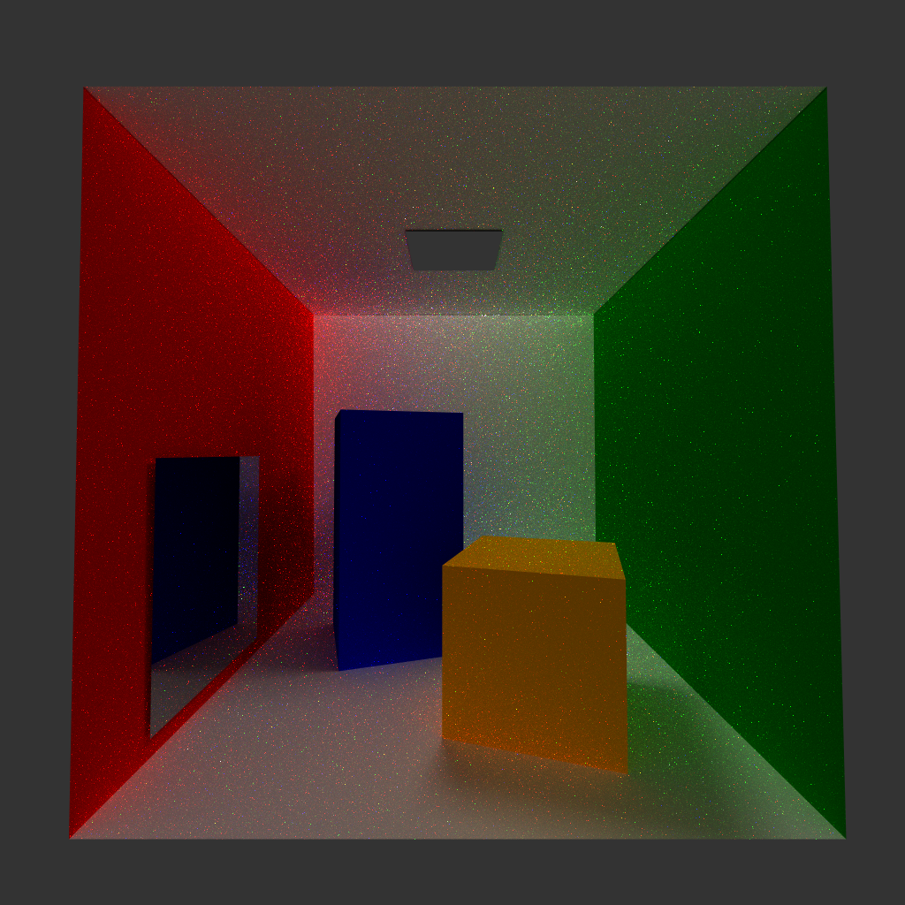

# VI-RT

A Ray-tracing engine made for a VI assignment 

## Table of Contents
- [About](#about)
- [Usage](#usage)
- [Screenshots](#screenshots)

## About
Ray-tracing engine made for a VI assignment 

## Usage
#### Windows
- Download ZIP or  
- Download CMAKE
https://cmake.org/download/
or already have CMAKE VERSION 3.10 or up.

- Have the following configuration (Have the default x64 compiler)

- Click on Open Project

- Click play

#### Linux

- ???

## Screenshots

